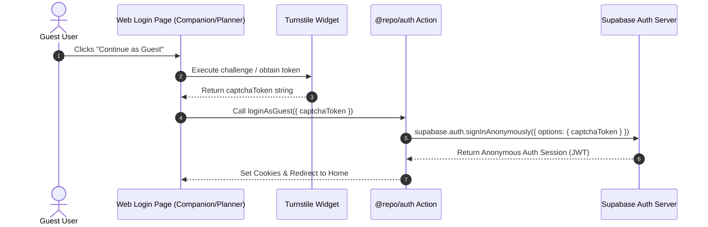

# Cloudflare Turnstile CAPTCHA for Anonymous Sign-ins 🛡️

## Objective
Enhance Supabase Anonymous Sign-in security by adding Cloudflare Turnstile CAPTCHA verification to prevent automated bot spam from creating dummy records in `auth.users`.

## Prerequisites & Dashboard Setup
1. **Cloudflare Dashboard**: Create a Turnstile Site Key & Secret Key in Cloudflare.
2. **Supabase Dashboard**:
   - Go to **Authentication > Security and Protection > CAPTCHA protection**.
   - Select **Cloudflare Turnstile**.
   - Input **Site Key** and **Secret Key**.
3. **Environment Variables**:
   - Add `NEXT_PUBLIC_TURNSTILE_SITE_KEY` to `.env.local` / deployment environment variables for `apps/companion` and `apps/planner`.

## Architecture & Integration Plan

## Implementation Steps

### 1. `@repo/auth` Updates
- Update `loginAsGuest(options?: { captchaToken?: string })` server action in `packages/auth/src/actions.ts`.
- Pass `captchaToken` inside `options` to `supabase.auth.signInAnonymously({ options: { captchaToken } })`.
- Update `mock.ts` mock clients to accept optional `captchaToken` parameter without failing validation.

### 2. Web UI Integration (`apps/companion` & `apps/planner`)
- Install lightweight turnstile package (e.g., `@marsidev/react-turnstile`) or add a client-side wrapper compound in `@repo/atomic-ui`.
- Render Turnstile widget on `login/page.tsx` when user interacts with guest sign in.
- Obtain `captchaToken` and pass it to the `loginAsGuest` server action.

### 3. Mobile UI Integration (`apps/companion-expo`)
- Native mobile apps: Pass captcha token using `react-native-webview` or configure mobile app client key exceptions / rate limiting in Supabase Security settings.

## Verification Checklist
- [ ] Turnstile widget renders cleanly without layout shifting.
- [ ] `signInAnonymously` succeeds when valid Turnstile token is supplied.
- [ ] Attempting `signInAnonymously` without token fails with 400 CAPTCHA error when CAPTCHA is enforced in Supabase.
