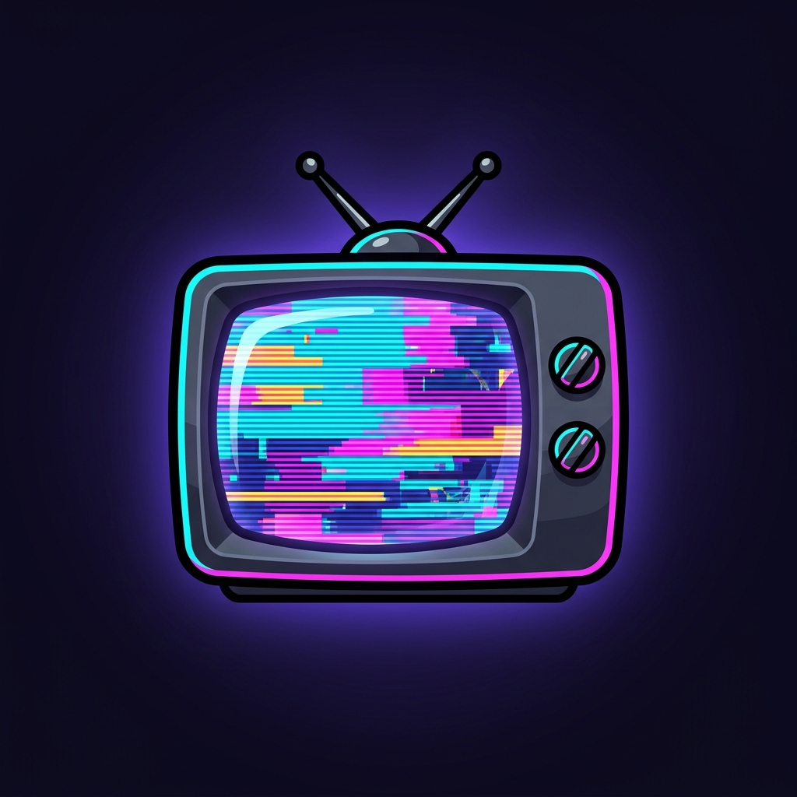
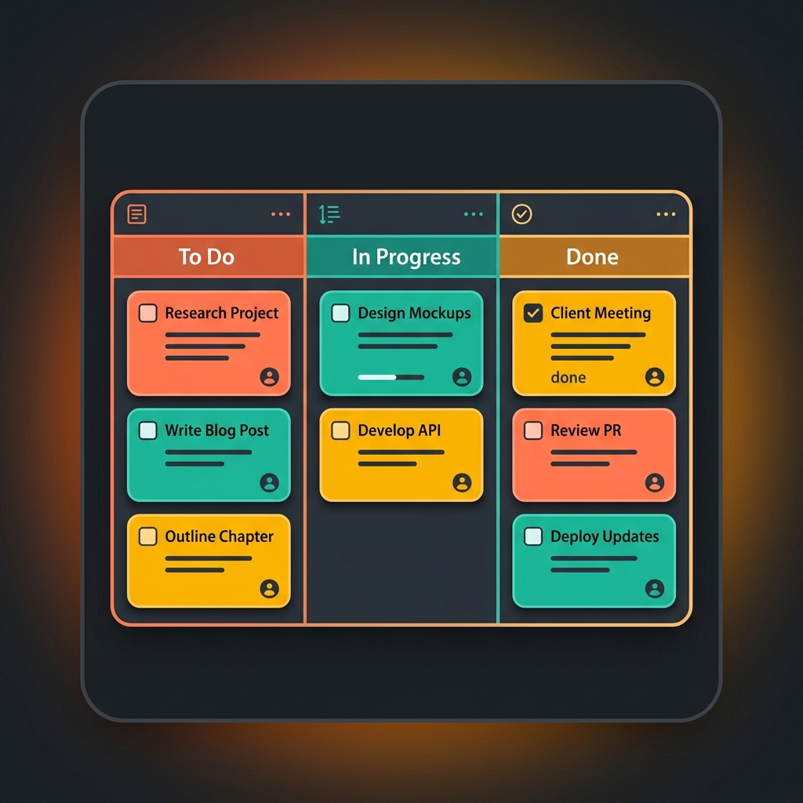

# Home App

## Description
The Home App is the central hub and main landing page for the md-rehman.dev monorepo. It serves as a gateway to explore all the other applications and portfolio projects built within this workspace.

## Screenshots

### Companion App Preview

### TV Set App Preview

### Planner App Preview

## Tech Stack
- **Framework:** Next.js (v16+)
- **Library:** React 19
- **Language:** TypeScript
- **Styling:** Shared UI packages (`@repo/ui`, `@repo/atomic-ui`)

